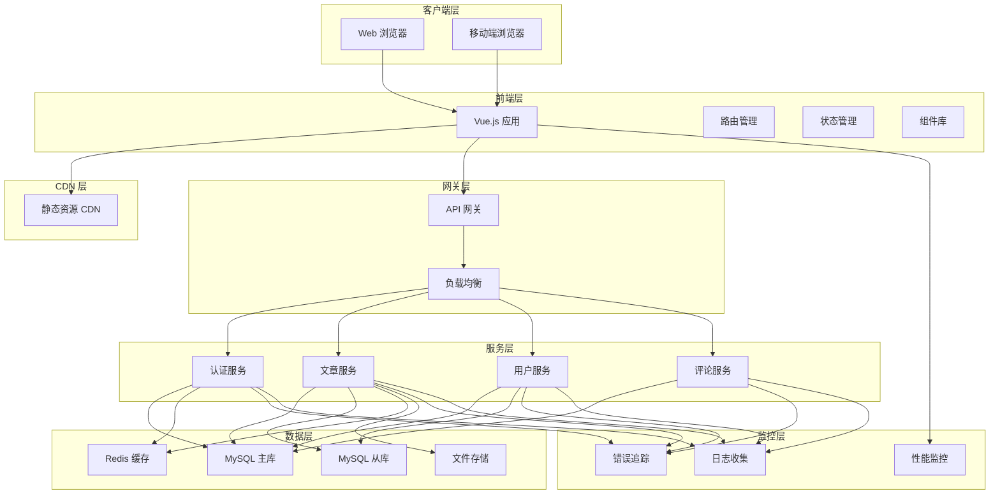
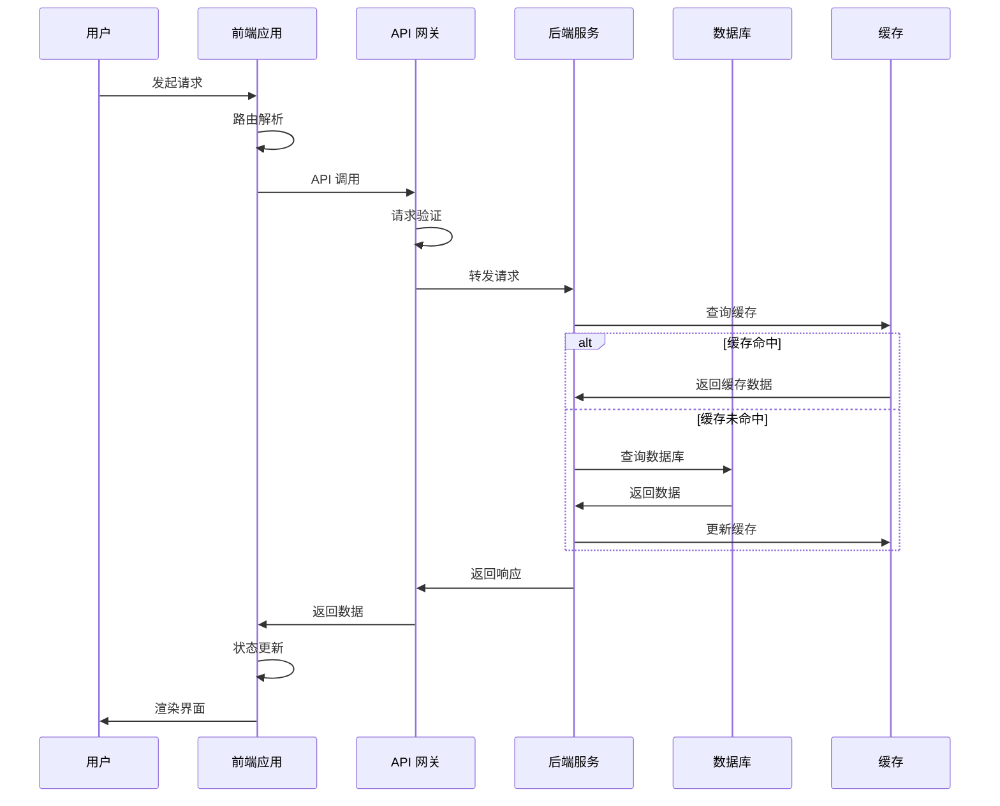
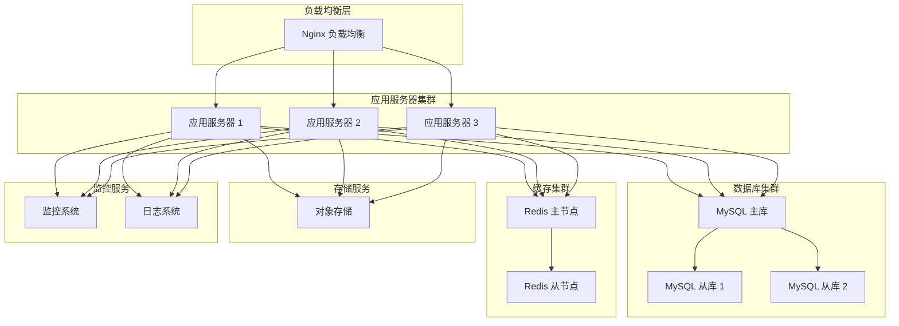

# 总体架构

Vue Blog 采用现代化的前后端分离架构，具有高性能、高可用、易扩展的特点。

## 架构概览

### 系统架构图

## 技术栈

### 前端技术栈

| 技术 | 版本 | 用途 |
|------|------|------|
| Vue.js | 3.3+ | 前端框架 |
| Vue Router | 4.2+ | 路由管理 |
| Pinia | 2.1+ | 状态管理 |
| Vite | 4.4+ | 构建工具 |
| Axios | 1.5+ | HTTP 客户端 |
| Day.js | 1.11+ | 日期处理 |
| Sentry | 7.74+ | 错误监控 |

### 后端技术栈

| 技术 | 版本 | 用途 |
|------|------|------|
| Node.js | 18+ | 运行时环境 |
| Express.js | 4.18+ | Web 框架 |
| MySQL | 8.0+ | 主数据库 |
| Redis | 6.0+ | 缓存数据库 |
| JWT | - | 身份认证 |
| Multer | - | 文件上传 |

## 设计原则

### 1. 单一职责原则
每个模块、组件和服务都有明确的职责边界，避免功能耦合。

### 2. 开放封闭原则
系统对扩展开放，对修改封闭，通过插件化和配置化实现功能扩展。

### 3. 依赖倒置原则
高层模块不依赖低层模块，都依赖于抽象接口。

### 4. 接口隔离原则
使用多个专门的接口，而不是单一的总接口。

## 核心特性

### 🚀 高性能

- **代码分割**: 按路由和功能进行代码分割
- **懒加载**: 组件和资源按需加载
- **缓存策略**: 多层缓存提升响应速度
- **CDN 加速**: 静态资源 CDN 分发

### 🔒 高安全

- **JWT 认证**: 无状态的身份认证
- **HTTPS**: 全站 HTTPS 加密传输
- **XSS 防护**: 输入验证和输出编码
- **CSRF 防护**: 跨站请求伪造防护

### 📈 高可用

- **负载均衡**: 多实例负载均衡
- **故障转移**: 自动故障检测和转移
- **健康检查**: 服务健康状态监控
- **优雅降级**: 服务异常时的降级策略

### 🔧 易维护

- **模块化设计**: 清晰的模块边界
- **标准化**: 统一的代码规范和 API 设计
- **文档完善**: 完整的技术文档
- **测试覆盖**: 全面的测试覆盖

## 数据流

### 用户请求流程

## 部署架构

### 生产环境部署

## 扩展性设计

### 水平扩展

- **无状态设计**: 应用服务器无状态，支持水平扩展
- **数据库分片**: 支持数据库水平分片
- **缓存集群**: Redis 集群模式支持

### 垂直扩展

- **微服务架构**: 服务可独立扩展
- **资源隔离**: 不同服务使用独立资源
- **性能调优**: 针对性的性能优化

## 监控和运维

### 监控指标

- **业务指标**: 用户活跃度、文章发布量等
- **技术指标**: 响应时间、错误率、吞吐量等
- **基础指标**: CPU、内存、磁盘、网络等

### 告警机制

- **阈值告警**: 基于指标阈值的告警
- **异常检测**: 基于机器学习的异常检测
- **多渠道通知**: 邮件、短信、钉钉等多渠道通知

### 日志管理

- **结构化日志**: 统一的日志格式
- **日志聚合**: 集中式日志收集和分析
- **日志检索**: 快速的日志查询和分析