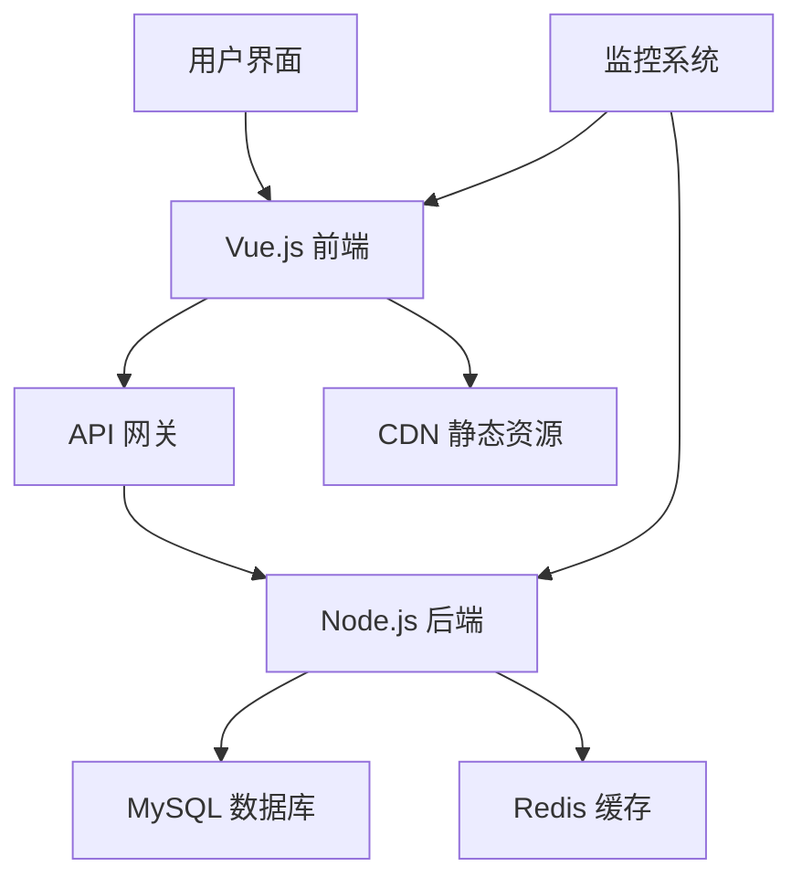

# Vue Blog 项目文档

欢迎来到 Vue Blog 项目文档！这是一个现代化的博客平台，采用 Vue.js 3 + Node.js + MySQL 技术栈构建。

## ✨ 特性

- 🚀 **现代化技术栈**: Vue 3 + Composition API + Pinia
- 📱 **响应式设计**: 完美适配桌面端和移动端
- 🎨 **优雅的 UI**: 简洁美观的用户界面
- 🔐 **安全认证**: JWT 令牌认证系统
- 📝 **富文本编辑**: 支持 Markdown 编辑
- 🔍 **全文搜索**: 强大的文章搜索功能
- 📊 **性能监控**: 集成性能监控和错误追踪
- 🧪 **完整测试**: 单元测试 + 集成测试 + E2E 测试

## 🏗️ 架构概览



## 🚀 快速开始

### 环境要求

- Node.js >= 16.0.0
- MySQL >= 8.0
- Redis >= 6.0 (可选)

### 安装步骤

1. **克隆项目**
   ```bash
   git clone https://github.com/your-username/vue-blog.git
   cd vue-blog
   ```

2. **安装依赖**
   ```bash
   # 前端依赖
   cd frontend
   npm install
   
   # 后端依赖
   cd ../backend
   npm install
   ```

3. **配置环境**
   ```bash
   # 复制环境配置文件
   cp .env.example .env
   
   # 编辑配置文件
   vim .env
   ```

4. **启动服务**
   ```bash
   # 启动后端服务
   cd backend
   npm run dev
   
   # 启动前端服务
   cd frontend
   npm run dev
   ```

5. **访问应用**
   
   打开浏览器访问 `http://localhost:5173`

## 📚 文档导航

- [**快速开始**](/guide/getting-started) - 详细的安装和配置指南
- [**架构设计**](/architecture/) - 系统架构和设计理念
- [**API 文档**](/api/) - 完整的 API 接口文档
- [**组件库**](/components/) - 前端组件使用指南
- [**部署指南**](/deployment/) - 生产环境部署说明

## 🤝 贡献指南

我们欢迎所有形式的贡献！请查看 [贡献指南](https://github.com/your-username/vue-blog/blob/main/CONTRIBUTING.md) 了解详情。

## 📄 许可证

本项目采用 [MIT 许可证](https://github.com/your-username/vue-blog/blob/main/LICENSE)。